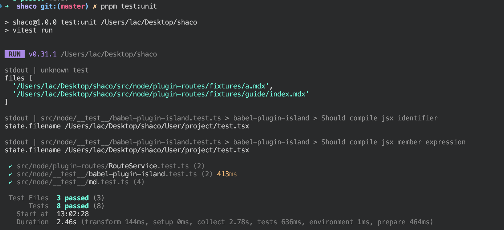
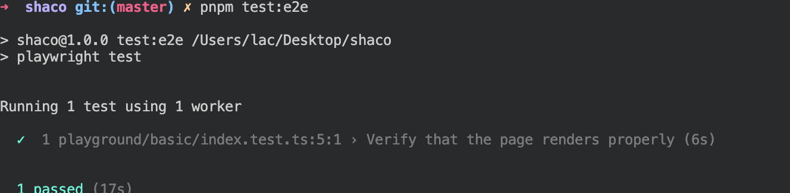
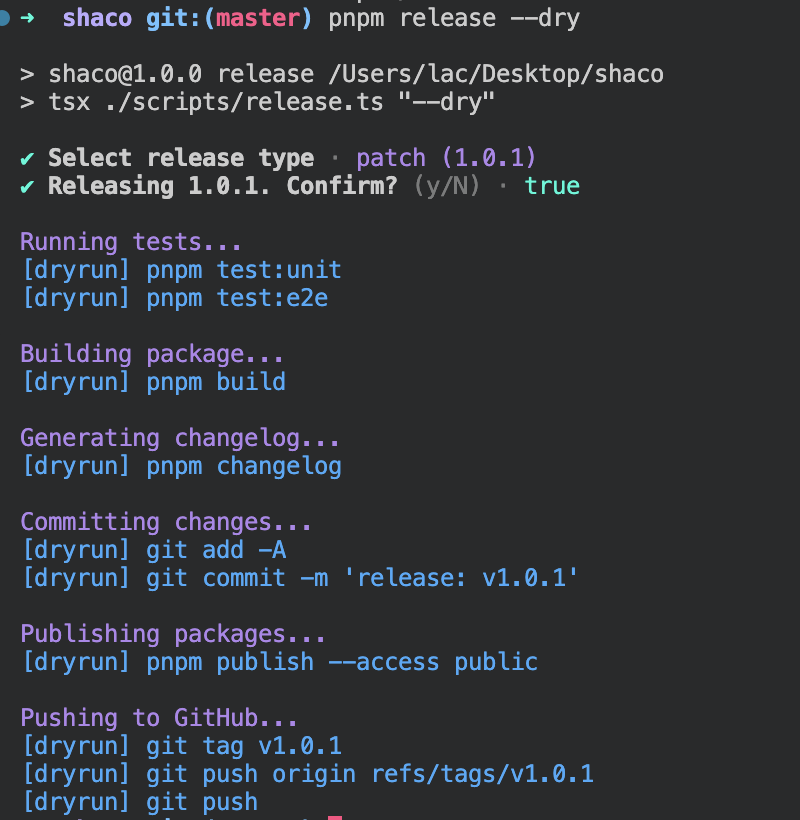

### Shaco

[](https://www.npmjs.com/package/shaco-ssg)
[](https://www.npmjs.com/package/shaco-ssg)

A static site generator(Base on Vite)

### Usage

```bash
# install
pnpm i shaco-ssg

# cli
shaco dev [dir]
## preview
shaco preview [dir]
## build
shaco build [dir]
```

#### For Example
`shaco build docs`
Dir config : `docs/config.ts`

```typescript
import { defineConfig } from '../dist'

export default defineConfig({
  title: 'xxx',
  themeConfig: {
    nav: [
      { text: 'Index', link: '/' },
      { text: 'Introduction', link: '/guide/' }
    ],
    sidebar: {
      '/guide/': [
        {
          text: 'Introduction',
          items: [
            {
              text: 'Touma Kamijou',
              link: '/guide/a'
            },
            {
              text: 'Uiharu Kazari',
              link: '/guide/b'
            },
            {
              text: 'Misaka Imouto',
              link: '/guide/c'
            }
          ]
        }
      ]
    }
  }
})
```
homePage content: `docs/index.mdx`

page conent: `docs/guide/index.mdx` / `docs/guide/b.tsx` ···(can use .jsx/.tsx/.md/.mdx)

ref: `/docs` dir  (use `theme-default`)

[Show Case](https://laclys.github.io/shaco/build/)


### Dev

```bash
pnpm i
# link to local
npm link

# compiler
pnpm run start

# test:unit
pnpm test:unit

# test:e2e
pnpm test:e2e

# release
pnpm release [--dry]

# run
shaco dev [dir]
## preview
shaco preview [dir]
## build
shaco build [dir]

```

---

unit test ✅


e2e test ✅



release flow



### MIT

Have fun!
